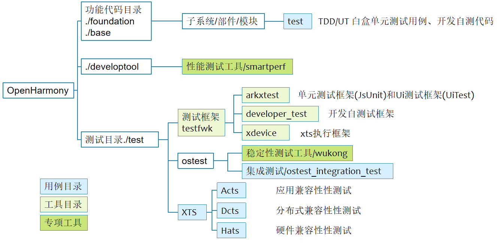
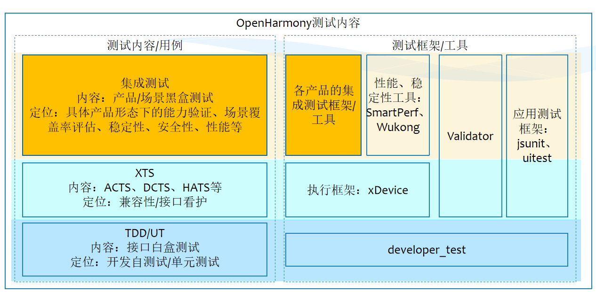
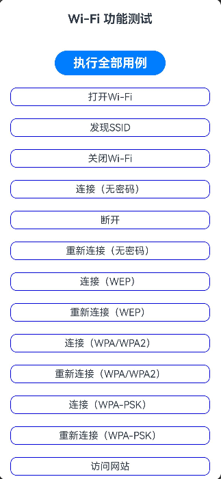
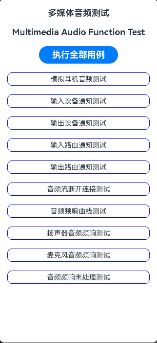
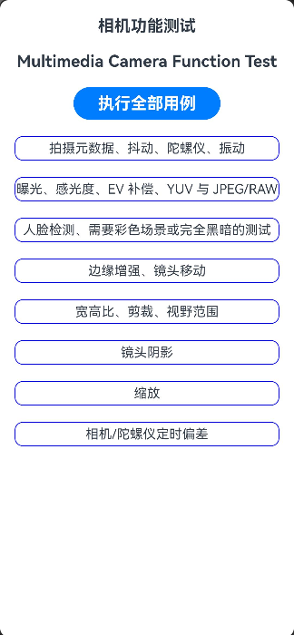
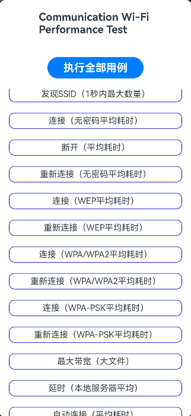
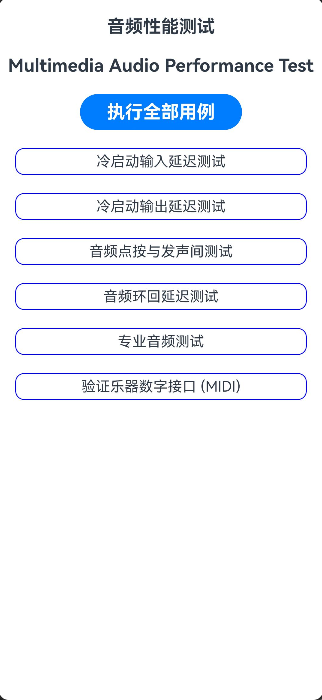
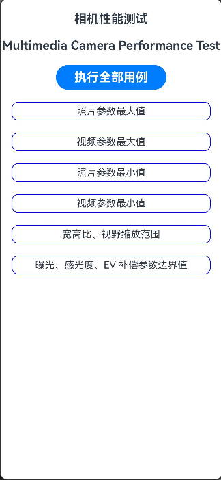
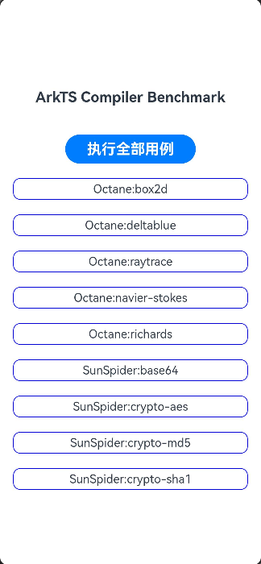
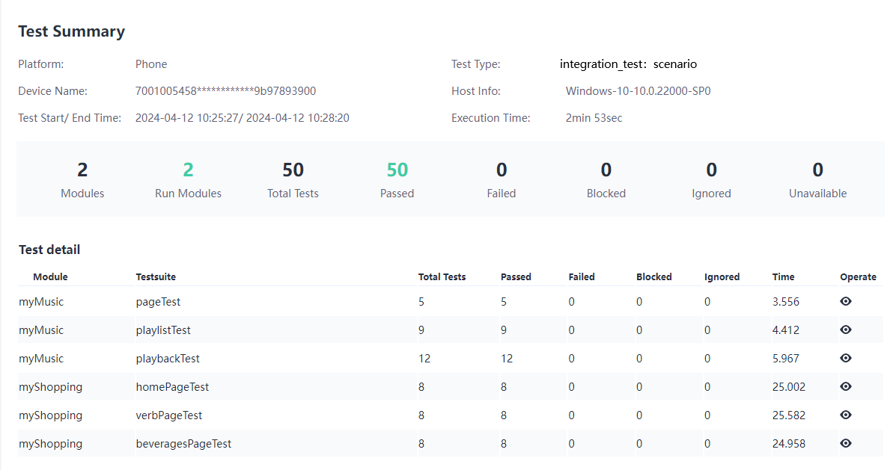

# 集成测试仓 ostest_integration_test

#### 介绍
集成测试仓用于统一规划、开发、管理操作系统产品化的场景、功能、性能、稳定性、安全性等测试用例。

集成测试仓在整体目录结构中的位置如下图：



集成测试在测试内容组成中的位置如下图所示：



#### 测试目标
* 通过功能和场景测试，保障OpenHarmony作为操作系统底座，基本功能可用，流程完善，并且可以覆盖主流的应用场景。

* 通过性能测试，标定系统基本性能指标，支持能力范围，为基于OpenHarmony的产品研发提供参考。

* 为基于OpenHarmony的产品研发提供基础测试方法、框架、用例，本测试仓的测试内容可以直接应用于二次开发的产品。

#### 测试策略建议
* 子系统/模块进行新增、修改、重构，开发完成后，建议进行相关功能和场景测试。
* 对外发布的各个Beta版本、Release版本建议进行功能测试和场景测试。
* 主干或重要分支建议定期（周/月）进行全量功能和场景测试。
* Release版本建议结合硬件平台进行性能测试。

#### 用例目录结构
```
├── function                //功能测试目录
│       └── communication	         //子系统
│               └── wifi	                //Wi-Fi模块功能测试
│               └── bluetooth	            //蓝牙模块功能测试
│               └── connectivity	        //网络连接功能测试
│       └── multimedia               //子系统
│               └── audio	                //音频模块功能测试
│               └── camera	                //相机功能测试
│               └── video	                //视频功能测试
│               └── image	                //图片功能测试
│       └── device_manager           //子系统
│               └── device_manager	        //设备管理功能测试
│       └── file_manager             //子系统
│               └── file_io	                //文件读写功能测试
├── performance	            //性能测试目录
│       └── arkts	                 //子系统
│               └── benchmark_arkts_compiler	 //编译器语言Benchmark用例 
│       └── arkui	                 //子系统
│               └── benchmark_component	         //组件创建、布局 BenchMark测试
│               └── benchmark_pipeline	         //组件管线 BenchMark测试
│       └── communication	         //子系统
│               └── wifi_perf	                //Wi-Fi模块性能测试
│               └── bluetooth_perf	            //蓝牙模块性能测试
│       └── multimedia               //子系统
│               └── audio_perf	            //音频模块性能测试
│               └── camera_perf	            //相机性能测试
│               └── video_perf	            //视频性能测试
├── scenario               //场景测试应用
│       └── MyMap	            //地图场景测试
│       └── MyMusic	            //音乐场景测试
│       └── MyNews	            //新闻场景测试
│       └── MyShopping          //购物场景测试
│       └── MyDoc	            //办公场景测试
│       └── MyChat	            //社交场景测试
│       └── MyGame	            //游戏场景测试
└── figures		           //readme 图片资源
└── docs		           //readme 二级文档
└── readme.md              //说明文档
```

#### 测试内容

集成测试仓规划的测试内容如下（持续更新）：

* 功能测试

| 编号  | 子系统  | 测试模块  |
|-----|------|-------|
| 1   | 设备管理 | 系统信息  |
| 2   | 多模输入 | 触摸/手势 |
| 3   | 通信   | Wi-Fi |
| 4   | 通信   | 蓝牙    |
| 5   | 通信   | 网络传输  |
| 6   | 媒体   | 音频    |
| 7   | 媒体   | 相机    |
| 8   | 媒体   | 视频    |
| 9   | 媒体   | 图片    |
| 10  | 文件   | 文件读写  |
| 11  | 分布式  | 分布式设备 |

* 场景测试

| 编号  | 场景     |
|-----|--------|
| 1   | 音乐播放   |
| 2   | 社交软件   |
| 3   | 办公软件   |
| 4   | 电商购物   |
| 5   | 新闻资讯   |
| 6   | 游戏     |
| 7   | 视频直播   |
| 8   | 智能设备控制 |

* 性能测试

| 编号  | 子系统    | 测试项              |
|-----|--------|------------------|
| 1   | 应用程序框架 | 应用启动、切换          |
| 2   | 文件     | 文件IO性能           |
| 3   | 通信     | 网络传输性能（Wi-Fi）    |
| 4   | 图形     | 图形显示性能           |
| 5   | 多媒体    | 音频性能             |
| 6   | 多媒体    | 视频性能             |
| 7   | 多媒体    | 相机性能             |
| 8   | 电源管理   | 功耗               |
| 9   | ArkUI  | ArkUI组件benchmark |
| 10  | ArkTS  | ArkTS语言benchmark |
| 11  | <综合>   | 游戏性能(CPU,GPU,IO) |


详细测试项参考各模块说明。

#### 测试应用示例
* 功能测试

 | Wi-Fi功能测试                       | 音频功能测试                                                   | 相机功能测试                                                    |
|----------------------|----------------------------------------------------------|-----------------------------------------------------------|
 |  |  |  | 

* 场景测试

| 音乐场景测试应用                                        | 新闻场景测试应用    |
|-----------------------------|-----------------------|
|  |  | 

* 性能测试

| Wi-Fi性能测试                      | 音频性能测试                                                           | 相机性能测试                  | ArkTS benchmark测试                |
|--------------------------------|------------------------------------------------------------------|--------------------------------------------|--------------------------------------------|
|  |  |  |  |

#### 使用说明

测试执行步骤：

1. 下载代码

从代码仓同步代码。

2. 编译构建

【手动测试】在DevEco中运行test工程测试用例即可。
* 使用DevEco编译、运行测试：


* 查看测试结果：


【自动化测试】使用xDevice框架，环境搭建执行按后续步骤 3~5 操作：

* 当前使用DevEco手工构建，批量构建可以通过脚本，使用类似XTS的gn方式（后续将替换成hivigor）

1. 环境准备

* 测试环境创建四个目录和一个执行脚本：

    - config//json配置文件

    - tools//执行所需的工具：xdevice安装包

    - testcases//测试应用hap

    - report//报告输出目录

    - run.bat//执行脚本

* 将编译好的hap文件拷贝到testcases目录。

* 配置文件预置模板:

  - myShopping.json

```
{
  "description": "Configuration for myshopping Tests",
  "level": ["0","1","2"],
  "type": "function",
  "component": "player_framework",
  "syscap": [
        "SystemCapability.Multimedia.Media.AudioPlayer",
        "SystemCapability.Multimedia.Media.VideoPlayer",
        "SystemCapability.Multimedia.Media.AudioRecorder",
        "SystemCapability.Multimedia.Media.VideoRecorder",
        "SystemCapability.Multimedia.Media.AVPlayer",
        "SystemCapability.Multimedia.Media.AVRecorder"
      ],
  "driver": {
      "type": "OHJSUnitTest",
      "test-timeout": "180000",
      "bundle-name": "ohos.samples.myShopping",
      "module-name": "entry_test",
      "shell-timeout": "60000",
      "testcase-timeout": 30000
  },
  "kits": [
  {
      "test-file-name": [
          "myShopping.hap"
      ],
      "type": "AppInstallKit",
      "cleanup-apps": true
  }, {
      "type": "ShellKit",
      "run-command": [
          "power-shell wakeup",
          "power-shell setmode 602"
      ]
  }]
}
```

参考这个模板,给其他应用的测试hap创建json文件,创建后修改bundle-name，module-name，test-file-name ,这里注意应用的bundle-name的这个名称最好和hap的文件名一致,方便检索修改。

例如，修改后的myMusic.json如下：


```
{
  "description": "Configuration for myMusic Tests",
  "driver": {
      "type": "OHJSUnitTest",
      "test-timeout": "180000",
      "bundle-name": "ohos.samples.myMusic",
      "module-name": "entry_test",
      "shell-timeout": "60000",
      "testcase-timeout": 30000
  },
  "kits": [
  {
      "test-file-name": [
          "myMusic.hap"
      ],
      "type": "AppInstallKit",
      "cleanup-apps": true
  }, {
      "type": "ShellKit",
      "run-command": [
          "power-shell wakeup",
          "power-shell setmode 602"
      ]
  }]
}
```

4. 执行用例

    脚本参考：[run.bat](docs/run.bat)

    ```
    run -l 包名
    ```

    不同环境下，可以自行修改自动化执行的脚本。
5. 查看报告

    查看report输出的报告。
    

其他细节参考各测试应用使用说明。

#### 系统功能和测试执行

通过[功能和用例映射规则](docs/FeatureMapRule.md)定义”功能和用例的映射关系“和”支持执行方式“，体现在[用例设计规范](docs/CaseRule.md)中。


#### 规范

1.  代码规范

    查看[代码规范](https://gitee.com/openharmony/applications_app_samples/blob/master/CodeCommitChecklist.md)。
2.  工程结构规范

    查看[工程结构规范](https://gitee.com/openharmony/applications_app_samples/blob/master/CodeCommitChecklist.md)。
3.  README编写规范

    查看[README编写规范](https://gitee.com/openharmony/applications_app_samples/blob/master/CodeCommitChecklist.md)。
4.  用例设计规范

    查看[用例设计规范](docs/CaseRule.md)。

5. 应用质量规范

   查看[OpenHarmony应用质量要求](https://www.openharmony.cn/certification/moreStandard)。

#### 参与贡献

上述规划中的测试内容，包括不限于：
1.  功能测试:Wi-Fi、蓝牙、音频、视频等;
2.  场景测试：办公、媒体、游戏等;
3.  专项工具：应用性能、安全性、稳定性等;

有任何关于本仓的想法和问题请联系管理员或者提issue问题单。

共建操作步骤：
1.  Fork 本仓库
2.  新建 Feat_xxx 分支
3.  提交代码
4.  新建 Pull Request
