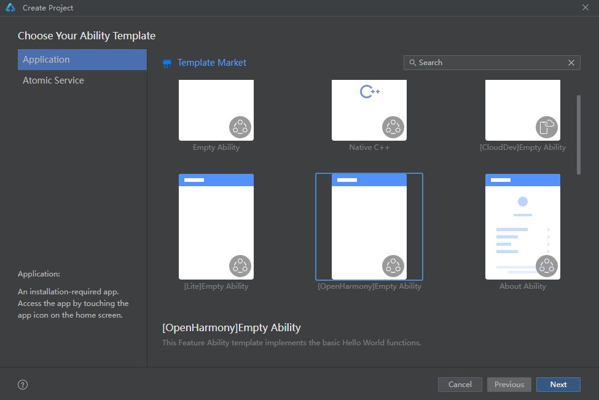
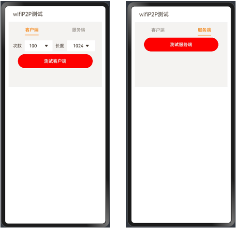
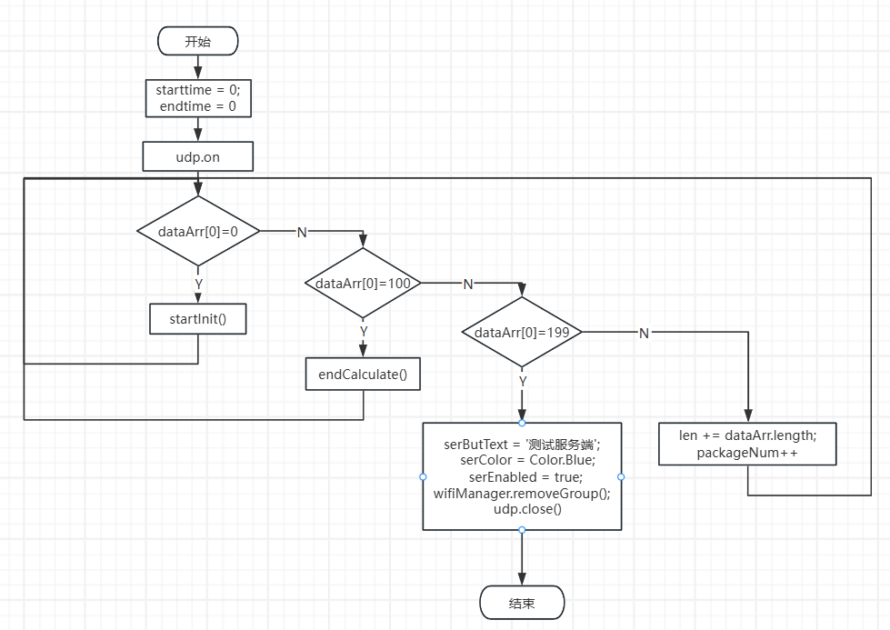

# README

## 应用开发

本应用使用的DevEcoStudio构建版本是4.1.0.400，构建于 2024年4月9日，API版本是11。

1. 通过DevEcoStudio创建项目“File->New->Create Project”创建一个工程。

   

2. 工程创建完毕后，在entry\src\main\ets创建wifiP2P相关目录，并且entry\build-profile.json5中配置worker。

   ```
   ets
   ├─ workers
   │  └─ Worker.ets
   ├─ pages
   │  └─ Index.ets
   └─ entryability
      └─ EntryAbility.ets
   ```

3. 界面入口为Index.ets，此处也为wifiP2P测试界把面。

   

   客户端界面可配置传输次数和数据长度，每次传输包含101个数据包，每个包中的元素范围从0至100。例如，第1个数据包中所有元素均为0，其长度依据应用设定。依此类推，客户端在每次回调中统计元素值为1至100的数据包数量和总长度，再通过发送含元素值为199的包来标志传输结束。

   服务端接收的数据流程如下图所示。

   
   $$
   每次收包个数 = 每次回调中内存包含1到100累计回调次数(单位:个)
   $$

   $$
   每次收包长度 = 每次回调中内存包含1到100累计数据长度(单位: 字节)
   $$

   $$
   每次收包用时 = 每次收包结束时间（收完元素100的时间） - 每次收包开始时间（收完元素0的时间）(单位: ms)
   $$

   $$
   每次传输速度 = 每次收包长度 * 1000 / (每次收包用时 *1024)(单位:KB/s)
   $$

   $$
   平均速度 = 共收到字节 * 1000 / (总计时 * 1024)(单位:KB/s)
   $$

   **需要注意的是，*因为客户端在主线程发送数据会存在appfreeze的问题，所以需要让客户端在与主线程并行的worker线程中发送数据，具体可参考[@ohos.worker (启动一个Worker) (openharmony.cn)](https://docs.openharmony.cn/pages/v4.1/zh-cn/application-dev/reference/apis-arkts/js-apis-worker.md)*。**

## 应用使用

### 准备

- 两块dayu200开发板
- 在使用前确保两块开发板的**wifi是开启状态**
- 安装应用程序：hdc install xxx.hap
- 关于两块开发板所用镜像适配情况： 4.1.1Release(OpenHarmony 4.1.7.8)版本和5.0 Beta1(OpenHarmony 5.0.0.25)版本上应用可以正常运行，但在5.0.0Release(OpenHarmony 5.0.0.71)版本上服务端无法正常显示收到数据。

### 使用

1. 在两块开发板上安装此应用；

2. 一台开发板选择客户端，一台选服务端（点击顶部文字”蓝牙Socket测试“可变换背景颜色，颜色为白色时，不打印日志，为粉色时打印日志）；

3. 服务端页面点击“测试服务端”按钮，客户端开发板进入设置-WLAN页面，待搜索到名为“ANOV”的wifi，使用密码“11223344”进行连接。

4. 客户端开发板连接成功后，打开应用进入客户端页面，选择测试次数和长度，再点击“测试客户端”按钮。

5. 客户端页面显示每次发包次数及包长，并在底部显示共测试次数、共发包个数和共发送长度，服务端页面会显示每次收包个数、包长、用时及速度，并在底部显示共测试次数、共收到字节、总计时以及平均速度。

6. 测试结果：本测试结果为在两种镜像下测试次数为100情况下的平均速度，具体结果如下：

   |                                          | 4.1.1Release版本（OpenHarmony 4.1.7.8） | 5.0 Beta版本（OpenHarmony 5.0.0.25） |
      | ---------------------------------------- | --------------------------------------- | ------------------------------------ |
   | 包长为10字节时的平均速度(单位：KB/s)     | 7                                       | 6                                    |
   | 包长为1024字节时的平均速度(单位：KB/s)   | 450                                     | 487                                  |
   | 包长为4096字节时的平均速度(单位：KB/s)   | 762                                     | 674                                  |
   | 包长为10字节时的总收包个数（单位：个）   | 1000                                    | 1000                                 |
   | 包长为1024字节时的总收包个数（单位：个） | 9996                                    | 9988                                 |
   | 包长为4096字节时的总收包个数（单位：个） | 9946                                    | 9976                                 |

​	从表格中可以看出，长度越大，传输速率越大，其原因可能是：每次回调使用的时间相差不大，但由于长度相差较多，长度间的差距远大于时间的差距，故包长越大，传输速率越大。需要注意的是，包长过长可能会导致数据发送失败。

### 常见问题及解决办法

常见问题：点击“测试服务端”按钮后，客户端开发板无法扫描到“ANOV”

可能原因：服务端开发板WLAN未打开

解决办法：进入设置-WLAN，打开WLAN状态，切掉wifiP2P应用后台并重新进入，再点击“测试服务端”按钮