# UI对比测试开发指南

## 文本用例（需求）

| 用例_名称  | 用例_编号  | 创建版本  |预置条件| 测试步骤|预期结果|自动化类型|
|-----|------|-------|------|------|------|------|
| 文本样式fontColor：Color类型   | SUB_ACE_UI_ATTRIBUTES_FONT_INTERFACE_0010 | OpenHarmony V400R001  |新建eTS页面|1、添加文本组件2、设置fontColor为Color.Blue  3、编译测试demo|3、编译通过，文本显示蓝色|UI对比|

## 编写工程和代码

### 新建或导入已有工程，创建目录和页面
在testability目录下创建页面，命名规则，用例编号除数字外，相同的用例在pages下创建一个同名子目录，每个编号的用例创建一个ets文件，文件名采用大驼峰如下：

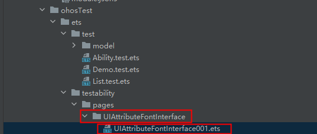

### 创建测试用例目录和文件

在test目录下创建用例目录，目录名称和2\.1中的页面相同并在后面加Test，用例文件和页面ets文件相同，后缀多了\.test，如下图：

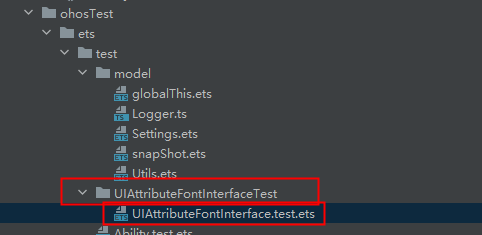

### 编写页面

按用例要求编写页面，创建文本组件，并设置颜色为Blue。

结构名称和文件名相同，组件需要设置id的，使用本文件名\_001按递增使用，避免和别的文件中的id重名。

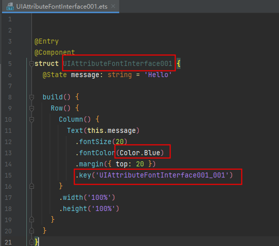

### 编写用例

修改类名，注释，测试套名称，用例名称，和测试用例文件及用例文档中对应，修改调用的页面文件路由，和页面路径对应：

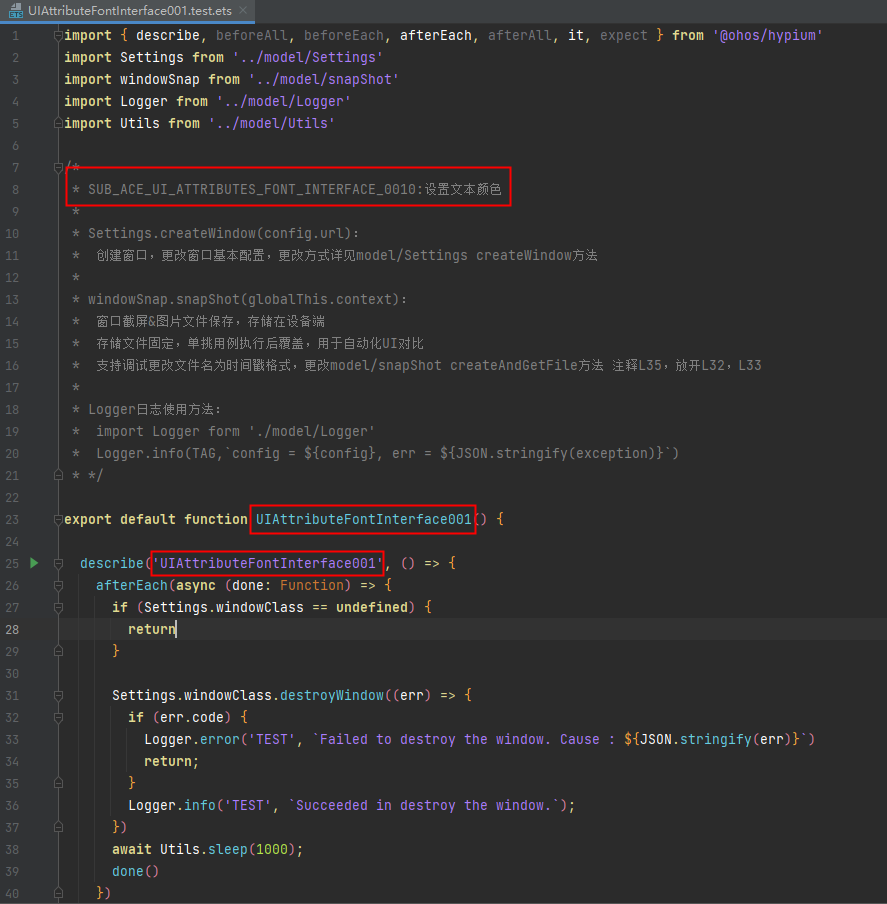

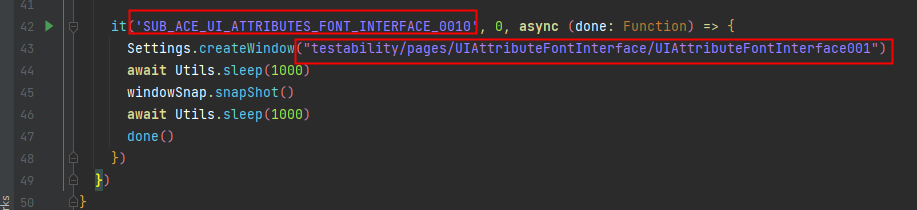

### 在List.test.ets中添加测试套和页面路由
注意：这里的页面是写在ohosTest模块下，不要写到main模块里。

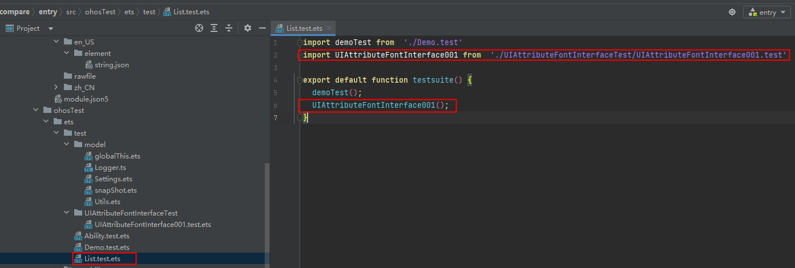

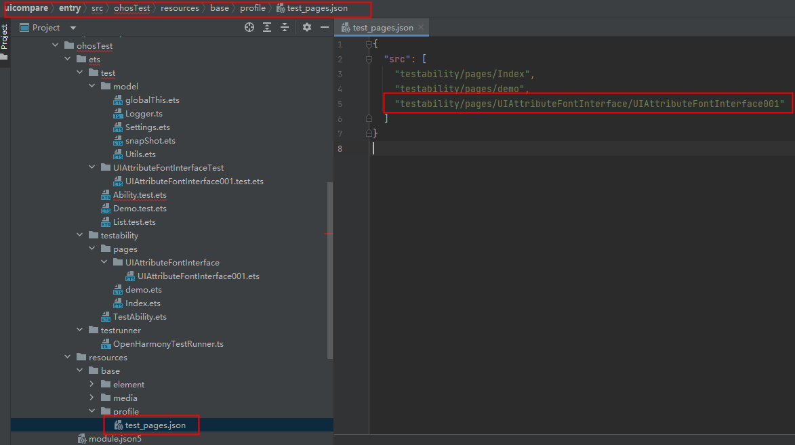

## 执行
### 编译
在IDE的file -> Project Structure 中自动签名：

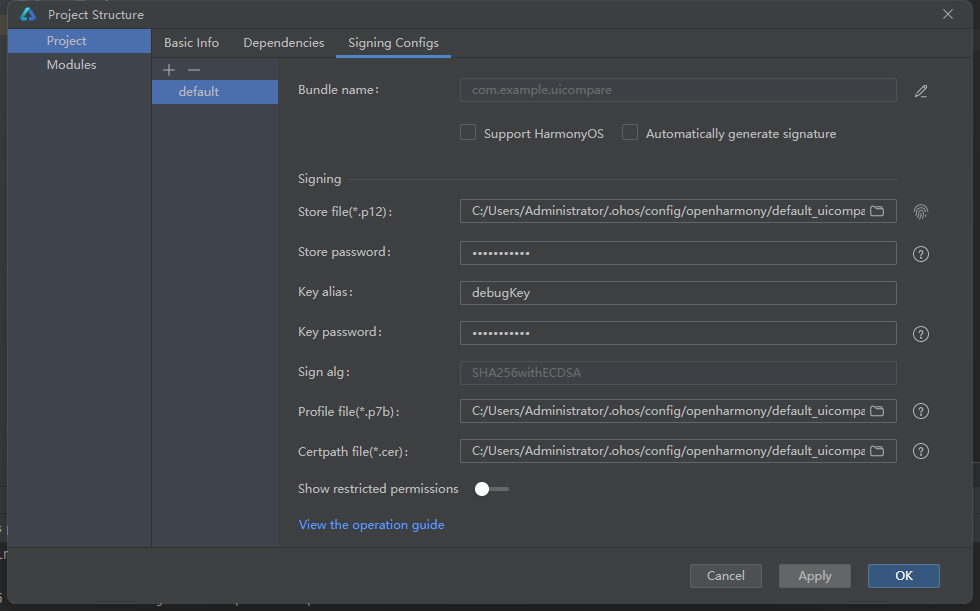

Build-> Rebuild 编译hap：

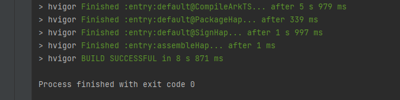

### 执行用例
右键xxxxx.test.ets 文件执行用例：

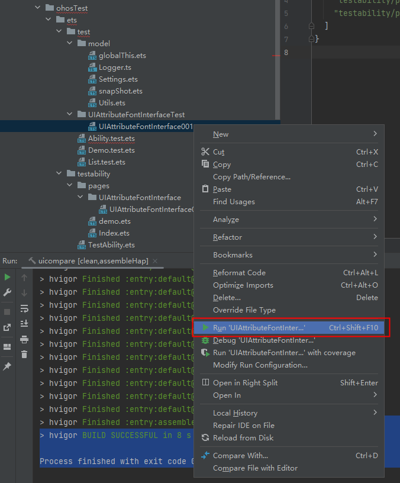

观察设备是否正常显示测试页面，显示了蓝色的文字：

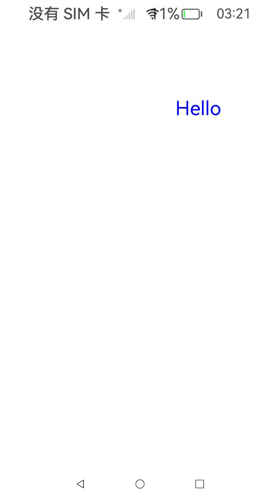

测试结果：

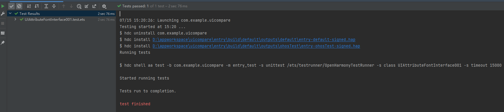

### 检查截屏图片：

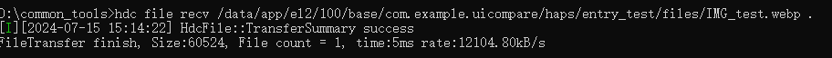

用hdc从设备拉取截屏图片：

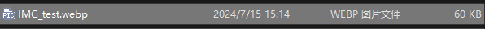

打开检查截图是否正确：

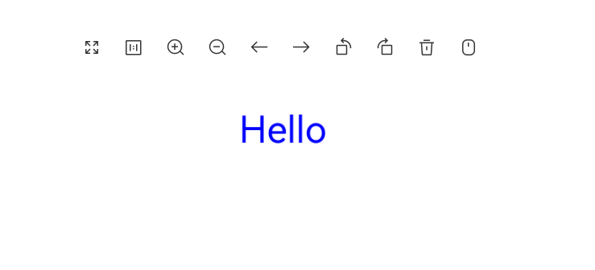

用例开发完成，且调试成功。

## 对比图片

使用对比脚本前需要安装python环境，安装依赖包：需安装三个包：openpyxl、numpy、pillow。

hdc配置到系统环境变量。

### 将编译的hap包拷贝到ui对比工具的hap目录下

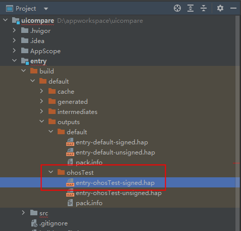

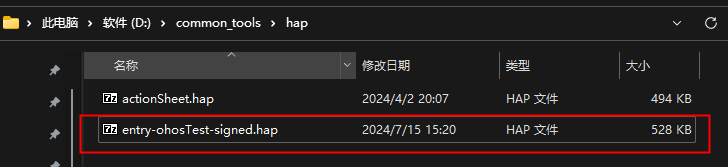

### 在excel表中添加测试用例

excel文件名和hap名必须相同，一个excel对应一个hap。

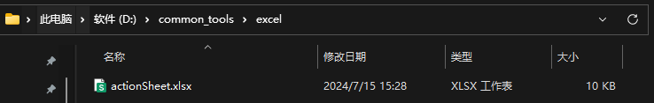

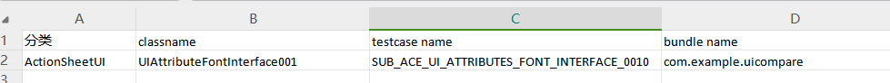

### 生成基线图片：

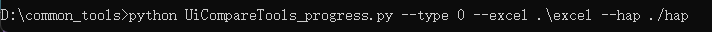

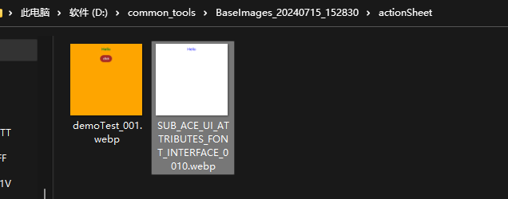

### 对此测试

指定基线图片目录和上中路径一致：

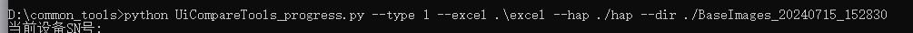

测试显示用例执行通过：

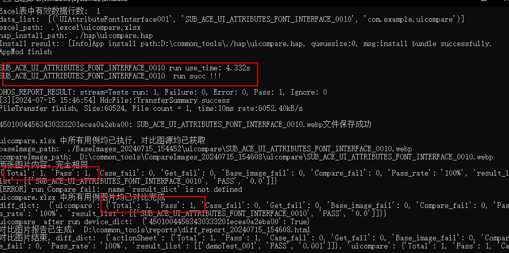

### 测试报告

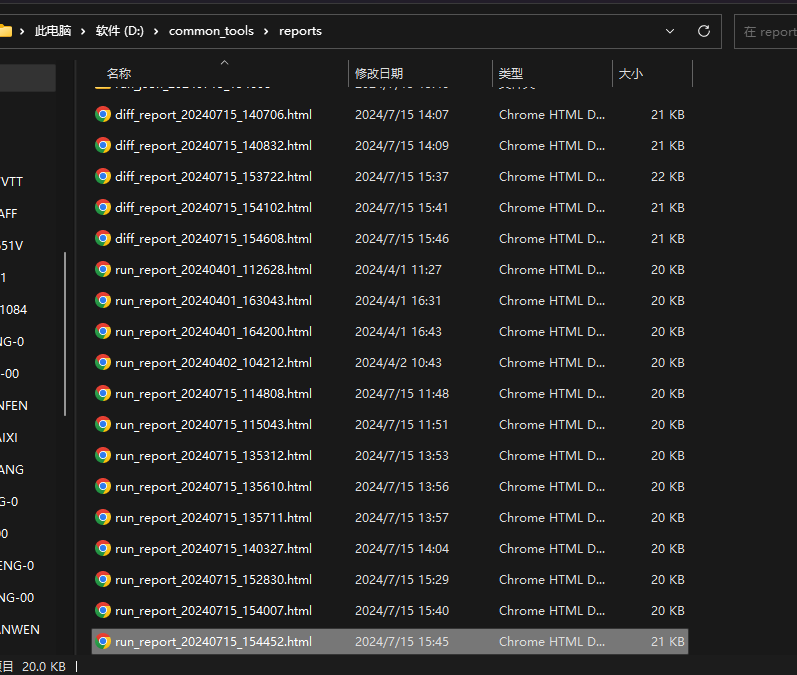

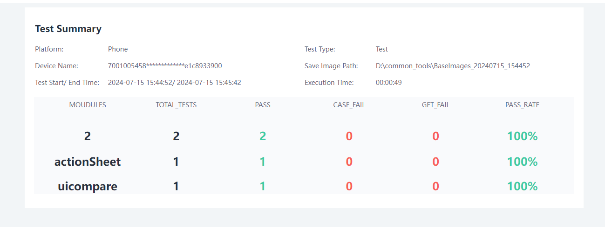

