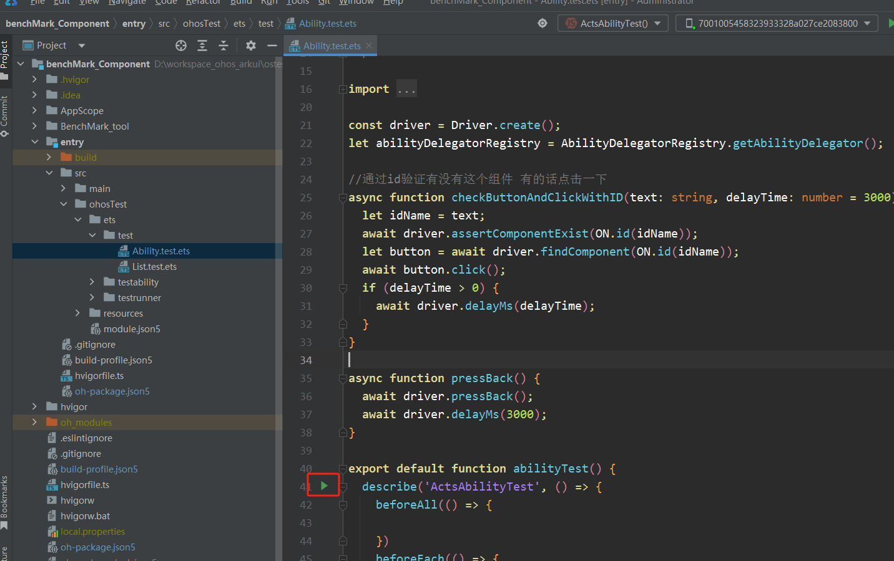
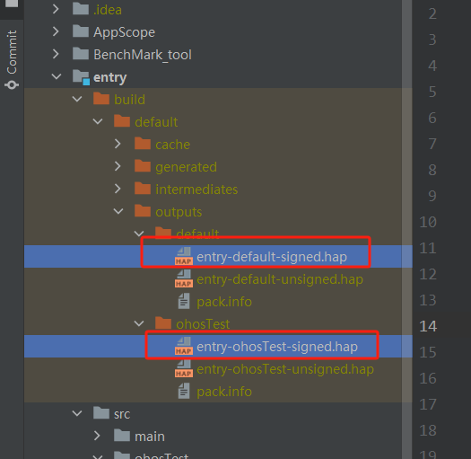
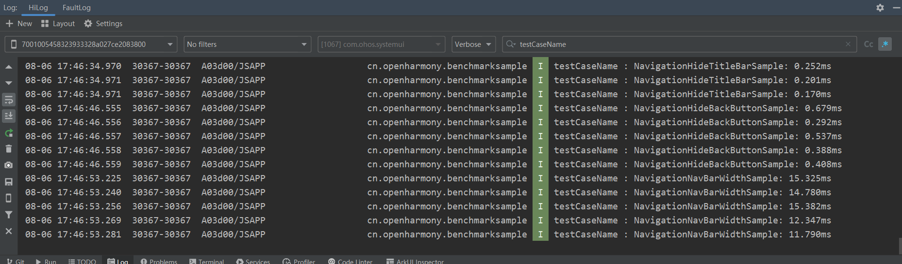

# benchMark_Component

#### 介绍
ArkUI组件性能测试用例

#### 目录结构
```
├── BenchMark_tool	    //解析trace数据工具
├── entry	           
│   └── src	           
|      └── main	       //测试用例代码 
|      └── ohosTest	   //单元测试
```

#### 使用说明

1. 安装python最新版本

2. 安装openpyxl、pandas

3. 将项目根目录下的BenchMark_tool文件夹复制到电脑D盘根目录下

4. 抓取C++层trace数据（组件布局耗时数据）

   运行单元测试（每次运行3-5个Function）
   

   将生成的两个hap包复制到D://BenchMark_tool文件夹中
   
 
   修改bytrace执行时间，将D://BenchMark_tool/1.bat中hdc_std shell "bytrace -t 360 -b 204800 --overwrite ace  > /data/%filename%"命令中-t后边的360替换为当前单元测试的执行时间（单位秒）

   执行D://BenchMark_tool/1.bat脚本，紧接着执行2.bat脚本；等待脚本执行结束会在BenchMark_tool文件中生成BenchMark.xlsx
   
5. 抓取js层组件创建耗时数据
   
   在D://BenchMark_tool下新建BenchMark_js.txt文件，将DevEco Studio控制台打印的数据（如下图数据）复制到BenchMark_js.txt文件中并保存，执行3.bat，等待脚本执行结束会在BenchMark_tool文件中生成BenchMark_js.xlsx
   

   
   
