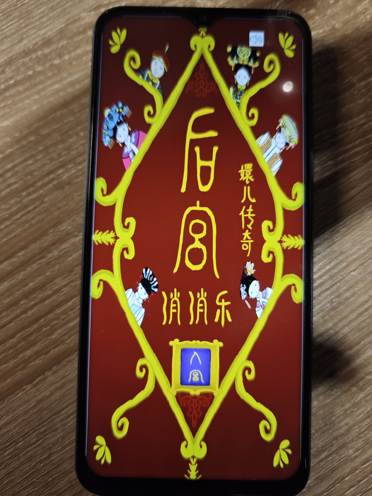
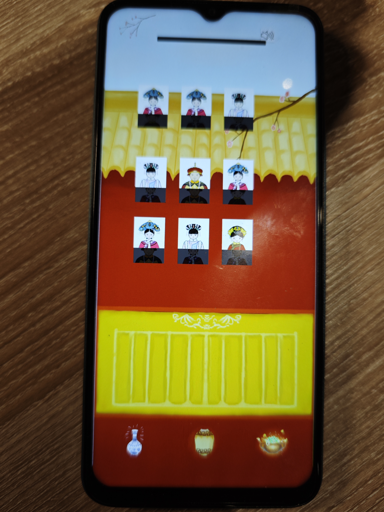
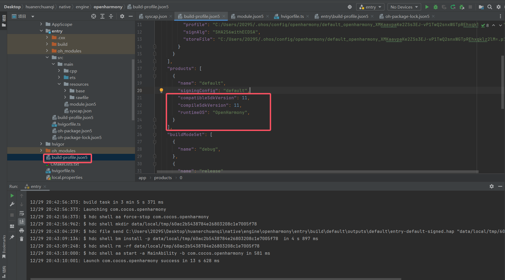
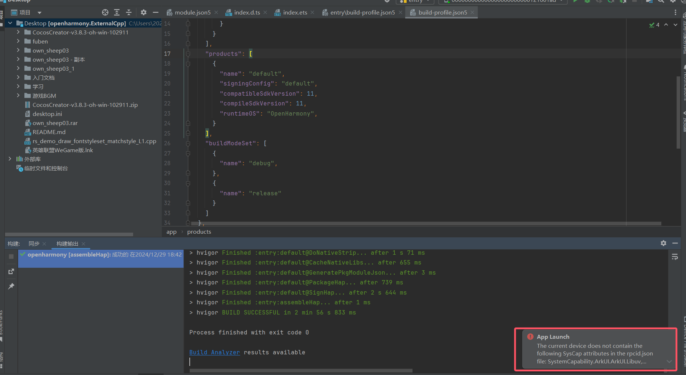
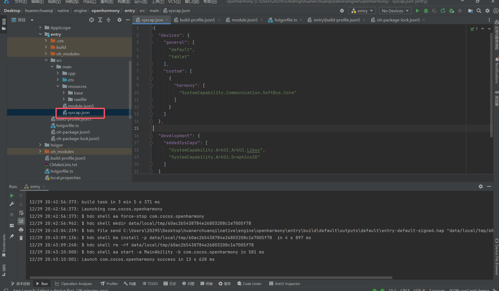

# Mygame_2d
## 项目介绍
本示例主要模拟移动端2D游戏场景，使用COCOS游戏引擎开发，是一款基于消消乐的通关游戏。本示例应用使用到了OpenHarmony设备的触屏,事件监听,声音播放,场景跳转等能力,以此测试设备的性能以及上述功能是否正常。
- 游戏演示视频：<https://www.bilibili.com/video/BV1ux6uYEEfa/?spm_id_from=333.999.0.0&vd_source=a5821c9d720d400d0d57ea85f2fbb705>
 
## 效果预览
<table>
    <tr>
        <td ><center>首页</center></td>
        <td ><center>游戏页</center></td>
        <td ><center>对话页</center></td>
    </tr>
</table>


## 运行条件

开发工具和引擎：开发游戏所使用的工具OpenHarmony5.0版本，和游戏引擎Cocos3.8.3。

条件一:本示例需要使用Deveco Studio5.0 Release(版本号：5.0.1)

条件二:本示例需要使用Cocos Dashboard2.2.4(编辑器版本3.8.3-oh)

条件三:本示例支持API11版本SDK

条件四:本示例建议在 OpenHarmony 开发者手机上运行（镜像为4.1）

## 工程目录
项目分为两个目录：CocosProject和OHProject。
- CocosProject:Cocos游戏目录结构，包含了游戏的所有资源、脚本等，用于开发游戏的逻辑和场景，具体目录结构如下：
```
assets/resources
|---animations      # 动画
|---bg              # 背景图片
|---dialog_image    # 人物头像
|---Prefabs         # 预制体资源
|---Scripts         # TS脚本（消除逻辑，关卡构建，对话，音频控制，场景过渡等）
|---Sounds          # 音频资源
scenes              # 场景资源(一共六个)
```
- OHProject:从Cocos Dashboard2中导出的OpenHarmony项目，用于构建、调试和运行游戏。

## 相关权限
无

## 下载
如需单独下载本工程，执行如下命令：
```
git init
git config core.sparsecheckout true
echo scenario/arkui/MyGame_2d/ > .git/info/sparse-checkout
git remote add origin https://gitee.com/openharmony-sig/ostest_integration_test.git
git pull origin master
```

## 注意事项及报错解决
导出的OpenHarmony工程需要更改配置与图中一致


报错为缺乏系统能力，如下图时，在src/main底下新增syscap.json文件并增加所需权限配置，且注意general底下设备需和module.json5中一致


