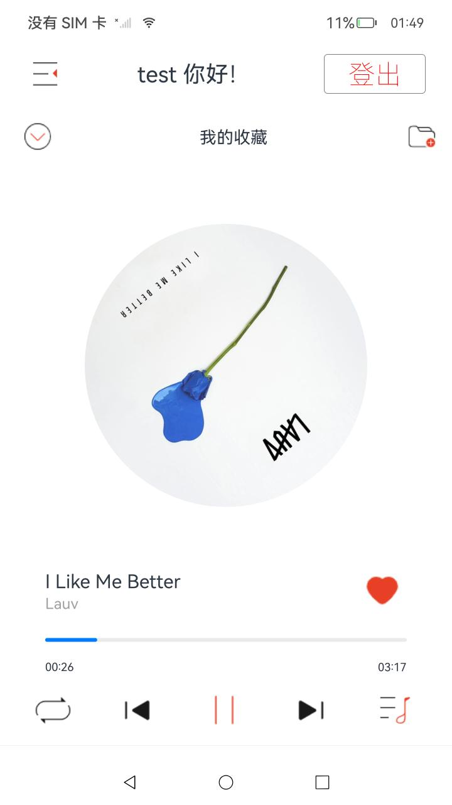
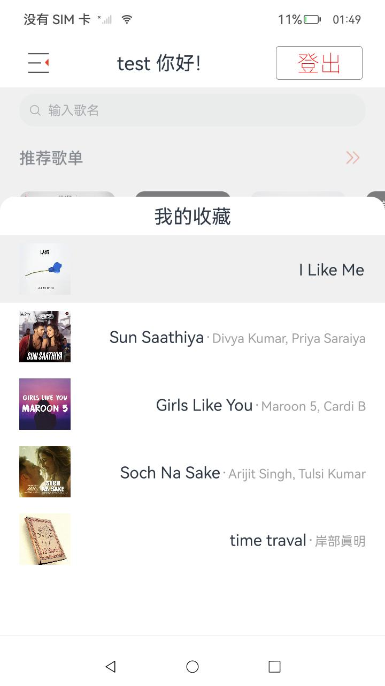
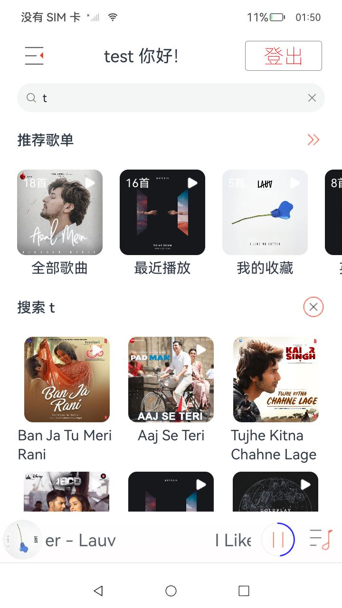
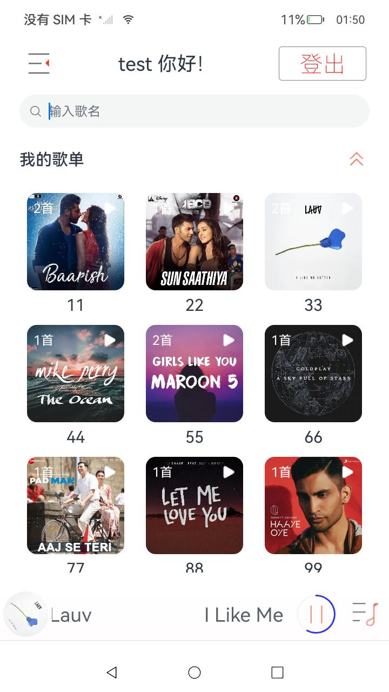
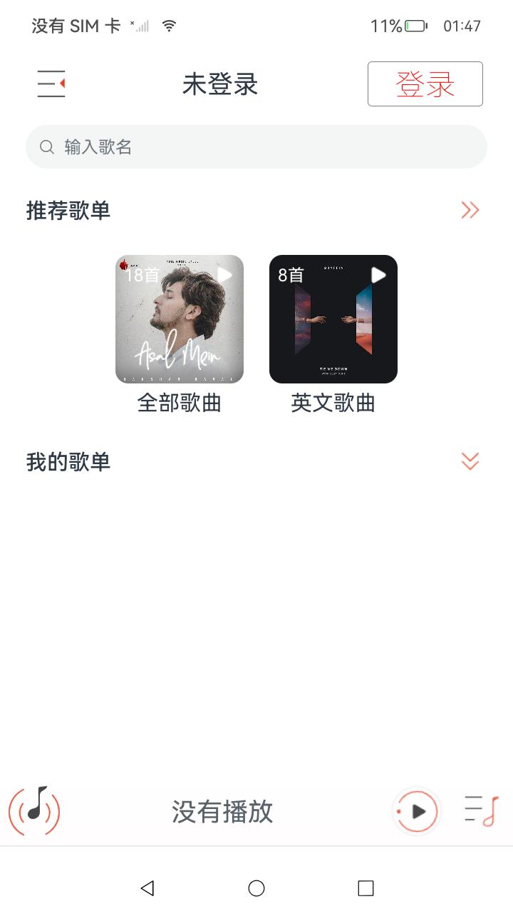

# 在线音乐

### 介绍

本示例主要实现网络音乐展示和播放，以此测试OpenHarmony是否支持网络信息获取，网络流媒体播放，后台任务等功能，以及UI展示是否存在问题。

测试设计及实现方法：

    1.参考网络音乐应用内容，设计应用的功能、数据、测试用例

    2.开发应用功能，展示功能和数据内容

    3.开发测试用例，检查应用功能及数据内容

    4.测试方式：
    1）运行应用手工测试，检查应用是否正确运行及内容是否正确
    2）通过DevEco 测试框架自动化执行测试套并查看结果和测试log

### 功能列表

#### 已开发功能：
    1. 首页
    1.1 未登录【推荐歌单】：内容由服务器控制
    1.2 登录状态的【推荐歌单】：最近播放、我的收藏，由服务器控制
    1.3 登录状态的【我的歌单】
    1.4 点击歌单播放，弹窗提示
    1.5 播放状态条
    1.5.1 封面图片及动画
    1.5.2 歌名及歌手
    1.5.3 播放/暂停按钮
    1.5.4 播放进度条（围绕播放按钮的环形）
    1.5.5 播放列表按钮
    1.6 搜索框 （未实现功能）
    1.7 设置按钮 （未实现功能）
    1.8 登录/登出按钮 （目前使用固定测试账号）
    1.9 登录用户名显示及动画
    1.10 登录状态下播放记录，用于展示在最近播放歌单
    1.11 下拉刷新

    2.播放详情页
    2.1 歌单标题
    2.2 收起播放详情按钮
    2.3 加入歌单按钮 （未实现功能）
    2.4 歌曲封面及动画
    2.5 歌名
    2.6 歌手
    2.7 收藏按钮 （目前仅展示，只能在网页端收藏）
    2.8 播放进度条
    2.9 已播放时间
    2.10 歌曲时长
    2.11 播放模式切换按钮
    2.12 上一首按钮
    2.13 播放/暂停按钮
    2.14 下一首按钮
    2.15 播放列表按钮
    2.16 点击播放详情中间区域切换：封面动画<->歌词，歌词界面标题展示歌名和歌手，不展示歌单名

    3. 播放列表页
    3.1 播放列表名称
    3.2 歌曲列表
    3.2.1 歌曲封面图片
    3.2.2 歌曲名称
    3.2.3 歌手名称
    3.3 播放中歌曲背景高亮
    3.4 点击歌曲换歌

    4.其他
    4.1 播放列表界面，按返回键回到首页及动画
    4.2 播放详情界面，按返回键回到首页及动画
    4.3 播放详情时打开播放列表，按返回键回到播放详情
    4.4 播放列表数据刷新动画
    4.5 后台播放
    4.6 登录状态持久化：重启设备后保持登录状态

#### 计划功能：
    1. 首页搜索歌曲 （已完成）
    2. 搜索歌曲展示   （已完成）
    3. 搜索歌曲展示页点击播放 （已完成）
    4. 歌曲详情页收藏/取消收藏功能 （已完成）
    5. 歌单
    5.1 从歌曲详情页加入创建并加入歌单
    5.2 从歌曲详情页加入已有歌单
    5.3 删除歌单
    5.4 从歌单删除歌曲
    5.5 歌单改名
    6. 登录注册页面
    7. 每日推荐歌单
    8. 播放模式
    9. 进度条拖动
    10. 其他设置
    11. 歌词
    12. 桌面播放卡片
    13. 歌曲分类及搜索
    14. 其他平台歌曲推荐、播放
    15. 音频焦点处理
    16. 其他界面交互效果(切换动画、点击效果)
    17. 设置页（关于、登录、登出、退出）

#### 未计划功能：
    1. 社交（用户信息，好友，分享，评论）
    2. 数据分析（统计播放历史、排行榜、歌曲偏好等）
    3. 修改密码，忘记密码，手机号注册等
    4. 安全（传输加密）

#### 已开发用例
  详见用例文档：[ohosTest.md](ohosTest.md)


### 效果预览

|                主页                 |               播放详情                |                播放列表                 |
|:---------------------------------:|:---------------------------------:|:-----------------------------------:|
|     |   |   |
|                搜索                 |               我的歌单                |                 未登录                 |
|   |  |      |


### 工程目录

```
├─main
│  │  module.json5
│  │  
│  ├─ets
│  │  ├─entryability
│  │  │      EntryAbility.ets
│  │  │      
│  │  ├─manager
│  │  │      PlayerManager.ets
│  │  │      ServerConstants.ets
│  │  │      
│  │  ├─model
│  │  │      AudioItem.ets
│  │  │      LrcLine.ets
│  │  │      PlayListData.ets
│  │  │      
│  │  ├─pages
│  │  │      Index.ets
│  │  │      
│  │  ├─utils
│  │  │      CommonUtils.ets
│  │  │      Logger.ts
│  │  │      
│  │  └─view
│  │          PlayerBar.ets
│  │          PlayerDetail.ets
│  │          PlayList.ets
│  │          PlayListItem.ets
│  │          SongCell.ets
│  │          
│  └─resources
│      ├─base
│      │  ├─element
│      │  │      color.json
│      │  │      string.json
│      │  │      
│      │  ├─media
│      │  │      icon.png
│      │  │      ic_public_arrow_down_0.png
│      │  │      ic_public_arrow_right.png
│      │  │      ic_public_arrow_right_grey.png
│      │  │      ic_public_comments.png
│      │  │      ic_public_favor.png
│      │  │      ic_public_list_cycle.png
│      │  │      ic_public_pause.png
│      │  │      ic_public_play.png
│      │  │      ic_public_play_last.png
│      │  │      ic_public_play_next.png
│      │  │      ic_public_play_white.png
│      │  │      ic_public_share.png
│      │  │      ic_public_view_list.png
│      │  │      ic_screenshot_line.png
│      │  │      ic_screenshot_line_select.png
│      │  │      startIcon.png
│      │  │      
│      │  └─profile
│      │          main_pages.json
│      │          
│      ├─en_US
│      │  └─element
│      │          string.json
│      │          
│      ├─rawfile
│      └─zh_CN
│          └─element
│                  string.json
│                  
├─mock
│      mock-config.json5
│      
├─ohosTest
│  │  module.json5
│  │  
│  ├─ets
│  │  ├─test
│  │  │      Ability.test.ets
│  │  │      List.test.ets
│  │  │      
│  │  ├─testability
│  │  │  │  TestAbility.ets
│  │  │  │  
│  │  │  └─pages
│  │  │          Index.ets
│  │  │          
│  │  └─testrunner
│  │          OpenHarmonyTestRunner.ets
│  │          
│  └─resources
│      └─base
│          ├─element
│          │      color.json
│          │      string.json
│          │      
│          ├─media
│          │      icon.png
│          │      
│          └─profile
│                  test_pages.json
│                  
└─test
        List.test.ets
        LocalUnit.test.ets

```

### 相关权限
ohos.permission.INTERNET
ohos.permission.KEEP_BACKGROUND_RUNNING

### 约束与限制

1. 本示例仅支持标准系统上运行，支持设备：RK3568；
2. 本示例仅支持API11版本SDK，版本号：4.1.7.5；
3. 本示例需要使用DevEco Studio 4.1 Release (Build Version: 4.0.0.400)；

### 下载

如需单独下载本工程，执行如下命令：

```
git init
git config core.sparsecheckout true
echo scenario/MusicPlayerOnline/ > .git/info/sparse-checkout
git remote add origin https://gitee.com/openharmony-sig/ostest_integration_test.git
git pull origin master
```