# MyGame

## 介绍

本示例主要模拟移动端 3D 游戏场景，使用 Unity 游戏引擎开发，是一个第三人称视角的驾驶类游戏。本示例应用使用到了 OpenHarmony 设备的触屏、加速度传感器、网络、声音以及震动等能力，以此测试设备的性能以及上述功能是否正常。

## 效果预览

- **场景变化**：

  <table>
    <thead>
      <tr>
        <td>白天场景</td>
        <td>黄昏场景</td>
        <td>夜晚场景</td>
      </tr>
    </thead>
    <tbody>
      <tr>
        <td>
          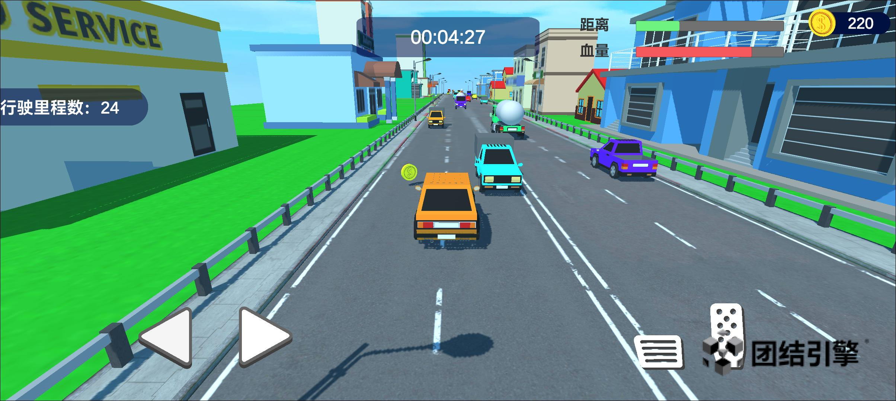
        </td>
        <td>
          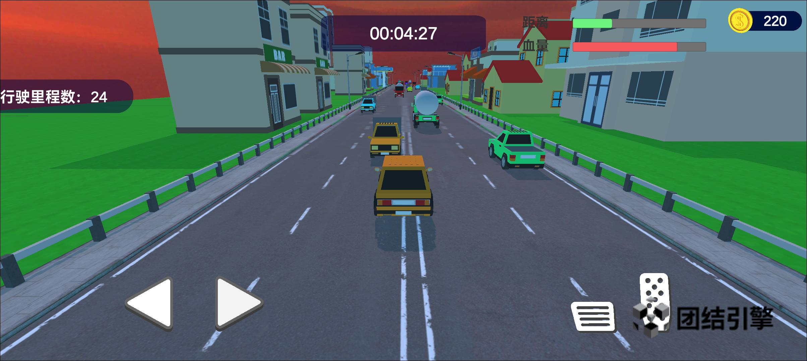
        </td>
        <td>
          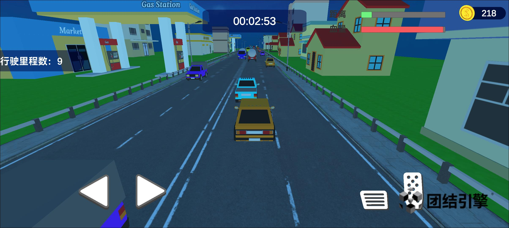
        </td>
      </tr>
      <tr>
        <td>
          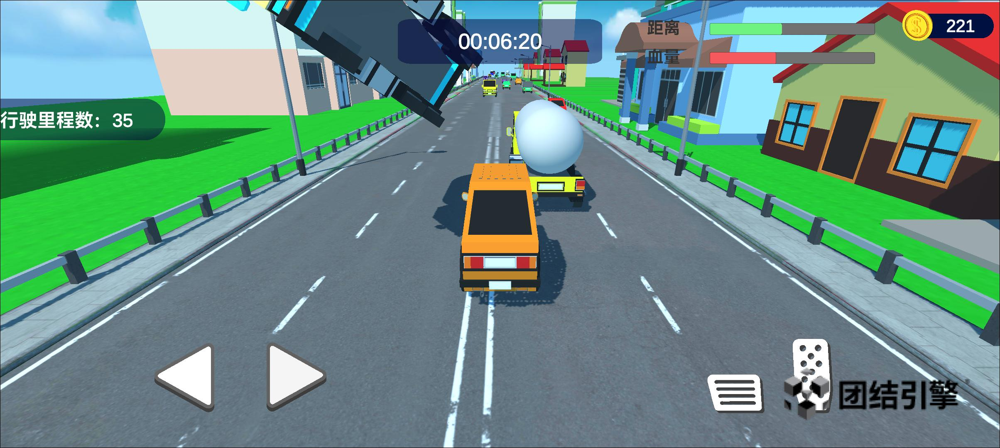
        </td>
        <td>
          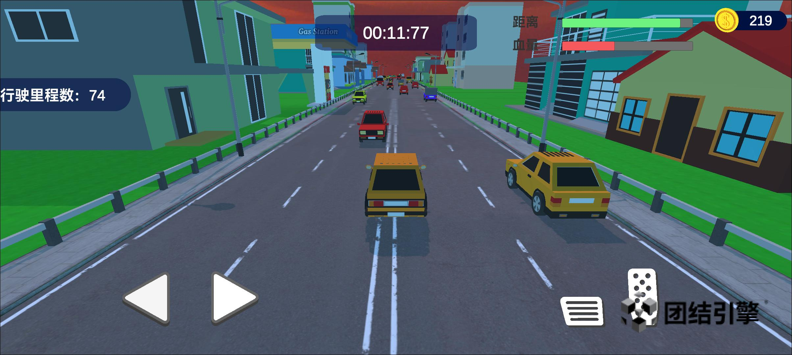
        </td>
        <td>
          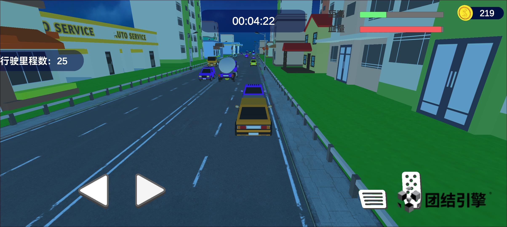
        </td>
      </tr>
    </tbody>
  </table>

- **体感操控**：

  

- **联机游戏**：

  

- **视频演示**：[单人游戏演示](https://www.dropbox.com/scl/fi/cubzy2657l5bouvqf1hdq/road-rage-1.mp4?rlkey=jkg08wtp4pbqgk0jwg5036wzl&st=ckiok4h7&dl=0)、[多人游戏演示](https://www.dropbox.com/scl/fi/5zz09ugsrvp48162y55ob/road-rage-2.mp4?rlkey=a6az52wfo5aoikqh5aoeekjc7&st=7fkvc4ge&dl=0)

## 工程目录

项目分为两个目录：[`UnityProject`](./UnityProject) 和 [`OHProject`](./OHProject)。

- `UnityProject`：Unity 项目目录，包含了游戏的所有资源、脚本等，用于开发游戏的逻辑和场景，具体目录结构如下：

  ```text
  Road-Rage/Assets/
  |---Animations      # 动画（面板切换、道具旋转、玩家车辆运动等）
  |---Audios          # 音频（语音、车辆引擎、碰撞、点击等）
  |---Materials       # 模型材质（车辆、道路、景观、道具等质）
  |---Models          # 模型资源（车身、车轮、道路、景观、道具等）
  |---Prefabs         # 预制体（车辆、道路、道具等）
  |---Scenes          # 游戏场景（仅有一个主场景）
  |---Scripts         # C# 脚本（车辆控制、区块和车流生成、分数计算、存档读档、UI交互等）
  |---Sprites         # UI 图形资源
  \---Textures        # 纹理资源（车辆、道路、天空盒等）
  ```

- `OHProject`：从 Unity Editor 中导出的 OpenHarmony 项目，用于构建、调试和运行游戏。

## 相关权限

无

## 约束与限制

1. 本示例建议在 OpenHarmony 开发者手机上运行（如 OH-DP-PRO，镜像版本 318 以上）；
2. 本示例仅支持 API 10 版本 SDK；
3. 本示例需要使用 DevEco Studio 4.0 Release (版本号：4.0.0.600)；
4. 本示例需要使用 Tuanjie Editor（版本号：1.1.0）。

## 下载

如需单独下载本工程，执行如下命令：

```
git init
git config core.sparsecheckout true
echo scenario/arkui/MyGame/ > .git/info/sparse-checkout
git remote add origin https://gitee.com/openharmony-sig/ostest_integration_test.git
git pull origin master
```

## 示例详细介绍

### 操控方式

游戏针对移动端设备提供了 _触屏_ 和 _加速度传感器_ 两种方式来控制车辆的运动。
在主菜单左下方的设置按钮中可以选择是否开启加速度传感器控制。

- **当关闭加速度传感器时**，车辆的左右移动是通过触摸屏幕左侧的方向按钮控制，加减速是通过触摸屏幕右侧的刹车、油门按钮控制；
- **当开启加速度传感器时**，玩家可以通过倾斜设备来控制车辆的左右移动，方向按钮将被隐藏，不再生效。
  加减速的控制不变，仍通过触摸屏幕右侧的刹车、油门按钮控制。

  <table>
    <thead>
      <tr>
        <td>触屏控制</td>
        <td>加速度传感器控制</td>
      </tr>
    </thead>
    <tbody>
      <tr>
        <td>
          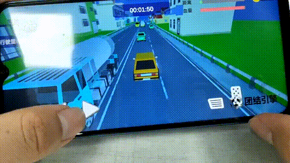
        </td>
        <td>
          
        </td>
      </tr>
    </tbody>
  </table>

### 游戏模式

游戏分为 _单人模式_ 和 _局域网联机的多人模式_。

- **在单人模式下**，游戏当前设计为两关，有车流量、玩家车辆速度和目标里程的区别；
- **在多人模式下**，游戏场景不变，只设有一关，目标里程数介于单人模式的两关之间。
  但玩家的碰撞、拾取金币行为将会对对手造成影响。

单人游戏模式和多人游戏模式的详细介绍可参见[游戏玩法与创意](#游戏玩法与创意)一节。

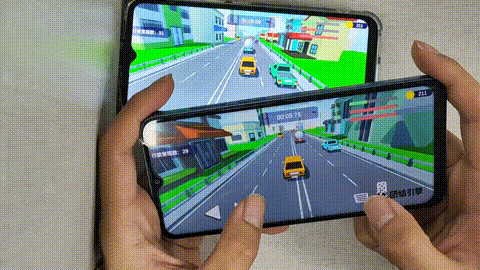

### 游戏玩法与创意

游戏启动后，进入游戏主界面，下方从左到右有以下按钮：`设置`、`车辆选择`、`多人游戏`（在发现其他玩家后出现）和`单人游戏`。

- **设置界面**：可以调整是否开启游戏声音、设备震动和加速度传感器控制。

  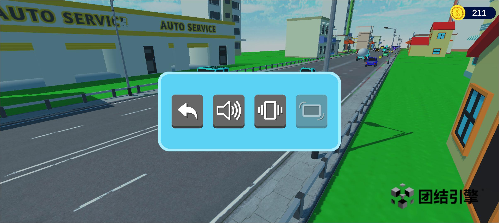

- **车辆选择**：游戏提供了多辆车供玩家切换，除初始车辆外，需要通过金币解锁。
-
  <table>
    <tbody>
      <tr>
        <td>
          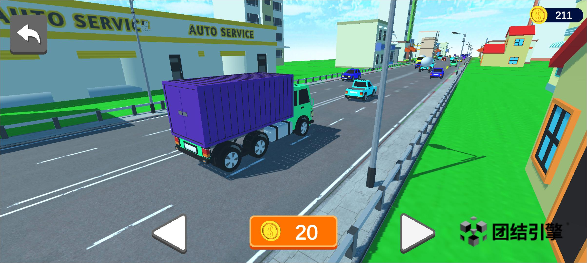
        </td>
        <td>
          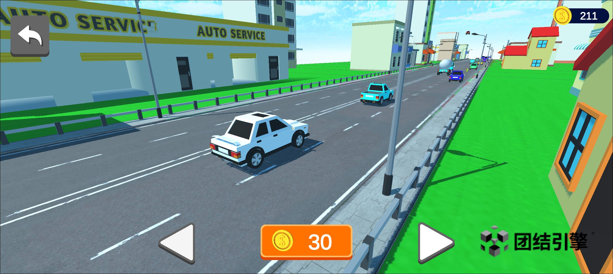
        </td>
        <td>
          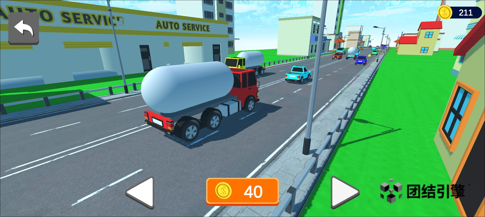
        </td>
      </tr>
    </tbody>
  </table>

- **单人游戏**：点击后进入游戏场景，屏幕上方显示游戏已进行的时间，右侧为行驶进度、车损程度、当前金币数，左侧为已行驶的里程数。屏幕下方为车辆的控制按钮：左右方向按钮和油门、刹车按钮。

  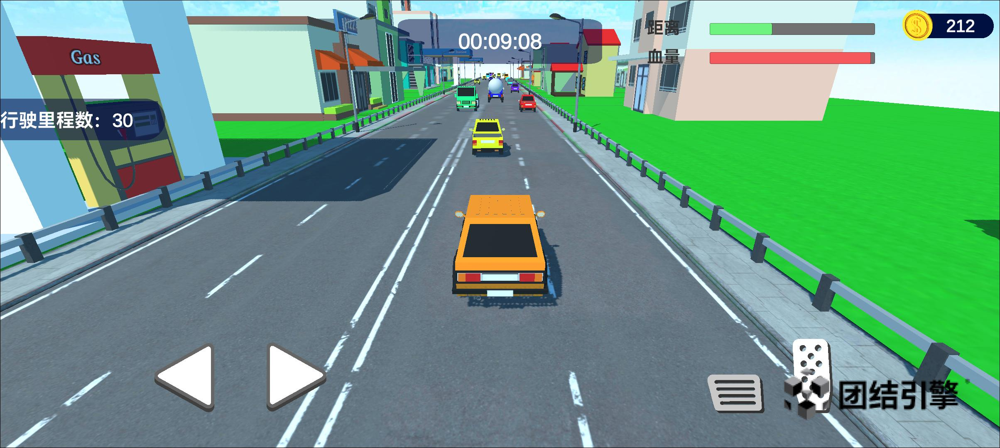

  游戏开始，玩家所控制的车辆逐渐加速，道路上有行驶速度较慢的NPC车辆，与其发生碰撞后玩家车辆受损（右上方血条减少），当前行驶速度和最大速度会相应减少。

  当发生碰撞时，为玩家车辆添加了夸张的变形动画和多种语音提示，以增加游戏的趣味性。

  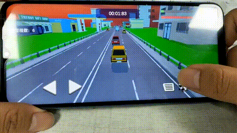

  当玩家拾取到金币时，玩家车辆可以恢复一定的血量。

  当碰撞次数达到一定值后（血条变为空），玩家车辆会发生爆炸，游戏结束。

  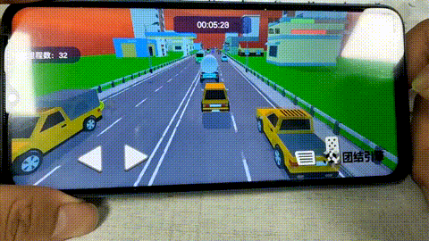

  单人游戏分为两关，目标里程数不同，当玩家行驶到目标里程数且未发生爆炸时，游戏胜利，可以前往下一关。

  <table>
    <tbody>
      <tr>
        <td>
          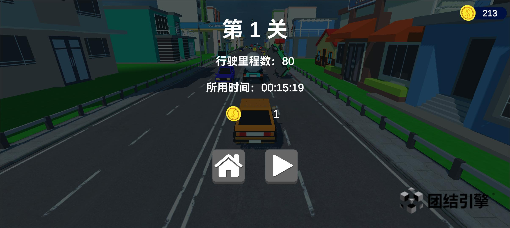
        </td>
        <td>
          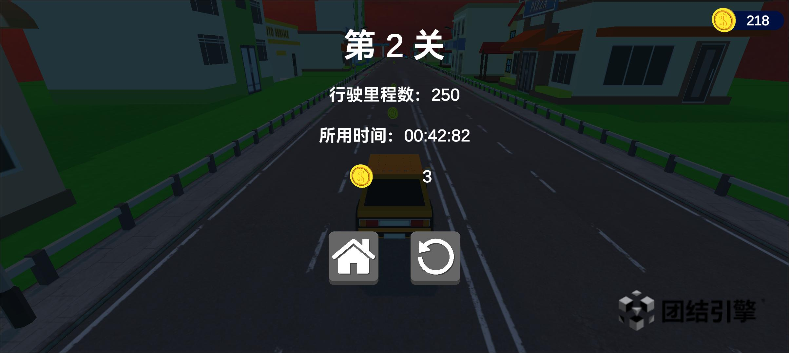
        </td>
      </tr>
    </tbody>
  </table>

- **多人游戏**：`多人游戏`按钮默认是隐藏的，在发现局域网内有其他玩家后显示。>
-
  游戏在场景加载完成后，将会自动在局域网内寻找玩家，屏幕上方的状态信息显示`正在寻找对手`；

  当发现其他玩家时将会显示`已找到对手`，`多人游戏`按钮将会显示在主界面上`单人游戏`按钮左侧。

  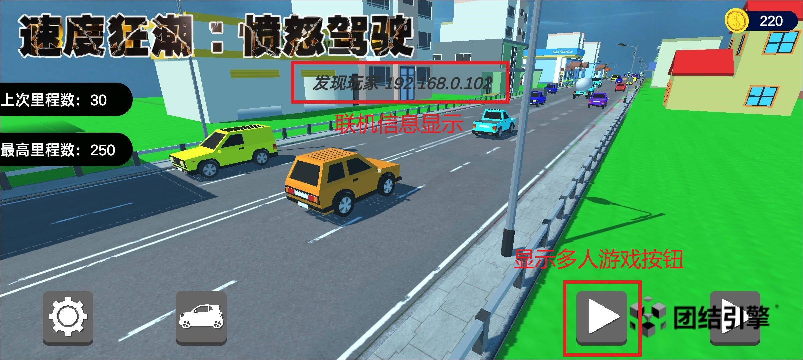

  点击`多人游戏`按钮后，已匹配到的对手将会同时开始游戏。

  

  基本玩法与单人游戏相同，玩家在各自的场景中进行游戏，但玩家的碰撞、拾取金币行为将会对对手造成影响。

  当玩家车辆碰撞，对手会收到提示，对手车辆得到加速增益；

  而当玩家拾取到金币时，恢复车辆血量，对手金币会相应减少，且对手车辆减速。

  

- **语音提示**：游戏在行驶中、发生碰撞、拾取金币、车辆爆炸等情况下，均有不同的语音提示，比如“加速”、“冲刺”、“滚”、“怎么这么菜”等，增添游戏的诙谐感。

- **关卡设计**：游戏设计了两个关卡，在第一关中，玩家车辆行驶速度较慢，车流量有限，玩家可以较轻松地躲避其他车辆，拾取金币，给玩家提供了熟悉游戏操作、熟悉场景的机会；
  而当玩家通过第一关，开始第二关的游戏时，车流量增大，车辆行驶速度加快，玩家将需要谨慎控制行驶速度，以避免碰撞。

  
