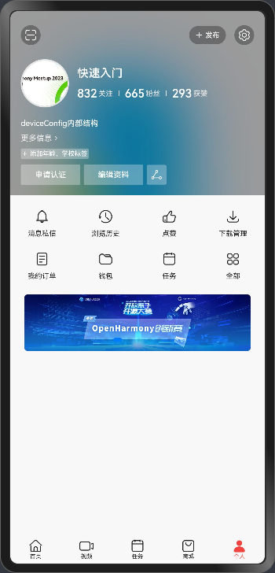
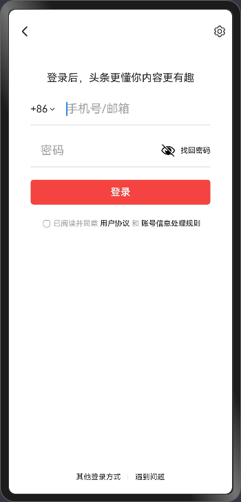
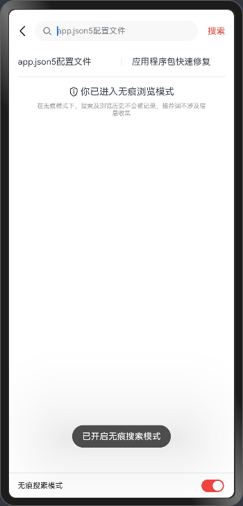
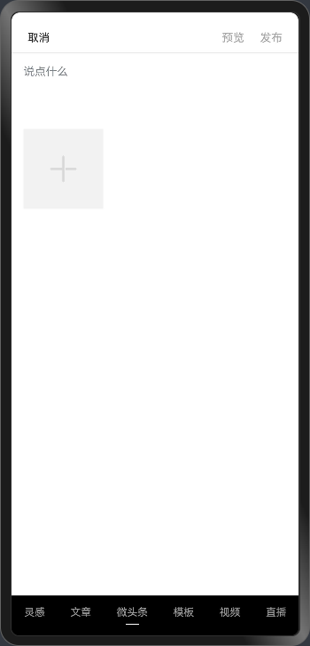

# 我的新闻

## 介绍

本示例主要模拟主流新闻资讯应用，使用 ArkUI 的组件实现应用的布局、动效等，复制应用的界面及交互，以此测试 ArkUI
是否足够支持主流新闻资讯应用的 UX 实现，以及是否存在问题。

## 效果预览

|              首页               |              商城页               |                个人页                |
|:-----------------------------:|:------------------------------:|:---------------------------------:|
|  |  |  |

|               登录页               |               搜索页                |                发布页                |
|:-------------------------------:|:--------------------------------:|:---------------------------------:|
|  |  |  |

## 工程目录

```text
MyNews/entry/src/
|---main
|   |---data
|   \---ets
|       |---common
|       |   |---constants                           // 常量定义
|       |   \---utils                               // 工具类、函数（网络请求、数据处理等）
|       |       |---GetArticles.ets
|       |       |---Login.ets
|       |       \---RandomResource.ets
|       |---entryability                            // 入口
|       |   |---EntryAbility.ets
|       |---pages                                   // 主要页面
|       |   |---LoginPage.ets
|       |   |---MainPage.ets
|       |   |---PublishPage.ets
|       |   \---SearchPage.ets
|       |---view                                    // 组件
|       |   |---Common                              // 通用组件
|       |   |   \---BasicUserInfo.ets
|       |   |---Home                                // 首页相关组件
|       |   |   |---Recommendation                  // 首页下的推荐Tab组件
|       |   |   |   |---ImgNewsOverview.ets
|       |   |   |   |---PureTextNewsOverview.ets
|       |   |   |   \---Recommendation.ets
|       |   |   |---Home.ets
|       |   |   |---HomeTabs.ets
|       |   |   \---TopBar.ets
|       |   |---Login                               // 登录页相关组件
|       |   |   |---BottomBtns.ets
|       |   |   |---FailureDialog.ets
|       |   |   |---LoginArea.ets
|       |   |   |---OtherLoginMethodsDialog.ets
|       |   |   \---TopBtns.ets
|       |   |---Mall                                // 商城页相关组件
|       |   |   |---GoodsCard.ets
|       |   |   |---GoodsList.ets
|       |   |   |---Mall.ets
|       |   |   \---TopBar.ets
|       |   |---Profile                             // 个人页相关组件
|       |   |   |---AdsSwiper.ets
|       |   |   |---FuncArea.ets
|       |   |   |---Profile.ets
|       |   |   \---UserInfoArea.ets
|       |   |---Publish                             // 发布页相关组件
|       |   |   |---MicroNews.ets
|       |   |   \---PublishTabs.ets
|       |   |---Search                              // 搜索页相关组件
|       |   |   |---BottomBar.ets
|       |   |   |---IncognitoModelIndicator.ets
|       |   |   |---TopBar.ets
|       |   |   \---TrendingTopics.ets
|       |   |---Task                                // TODO: 任务页相关组件
|       |   \---Video                               // TODO: 视频页相关组件
|       \---viewmodel                               // 数据管理、数据结构定义等
|           |---Article.ets
|           \---RouteParams.ets
\---ohosTest/ets/test
    |---List.test.ets
    \---Login.test.ets                              // 登录流程的测试用例
```

## TODO

- 首页（页面主体完成，Tab内容待补全）
    - 推荐Tab（添加更多文章类型，滑动刷新功能）
    - 关注Tab
    - 热榜Tab
    - ……
- 视频页
- 任务页（非主要功能，优先级低）
- 商城页（内容获取加载功能完成，其他非主要功能待定，优先级低）
- 个人页（页面主体完成，子页面及交互功能待补充）
    - 资料编辑页
    - 设置页
    - 扫一扫
    - ……
- 发布页（页面主体完成，实际功能待实现）
    - 媒体文件上传
    - 发布功能
    - ……
- 搜索页（页面主体完成，实际功能待实现）
    - 搜索功能
    - 记录搜索历史
    - 搜索结果页
    - ……
