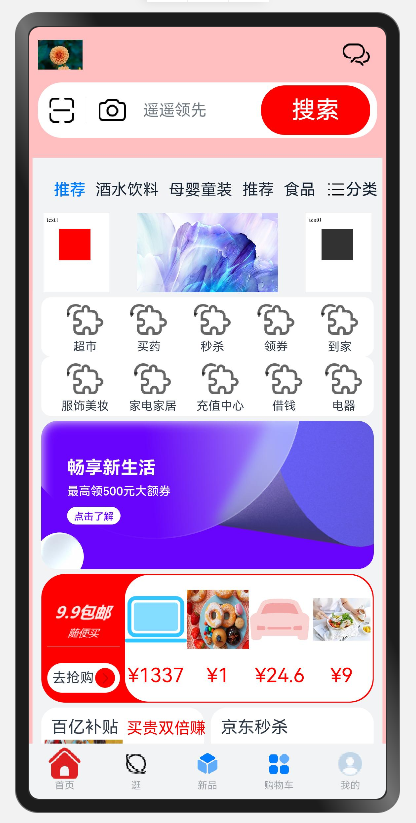

# 购物app

## 介绍

本示例主要模拟主流购物应用，使用 ArkUI 的组件实现应用的布局、动效等，复制应用的界面及交互，以此测试 ArkUI
是否足够支持主流购物应用的 UX 实现，以及是否存在问题;

## 效果预览



## 工程目录

```text
./entry/src/main/
├─ets
│  ├─entryability
│  │    EntryAbility.ets                // 入口
│  ├─pages
│  │  │─components
│  │  │  │─classification               // 自定义组件:分类
│  │  │  │─contentPlate                 // 自定义组件：内容板块
│  │  │  │─homeTab                      // 自定义组件：主页tab
│  │    Index.ets
```

## TODO

