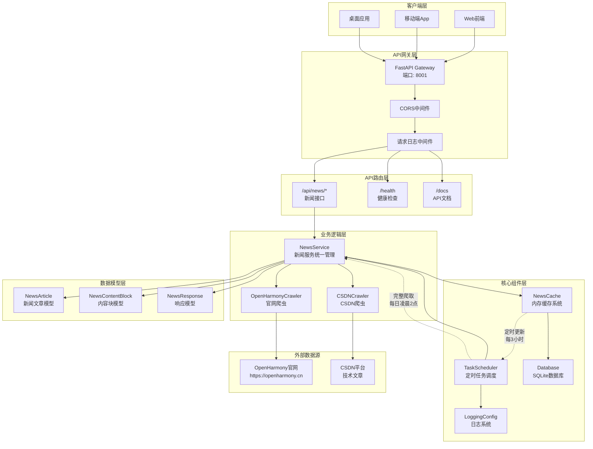

# NowInOpenHarmony 项目架构文档

## 项目简介
NowInOpenHarmony项目，是基于当下OpenHarmony相关资讯分散在各个平台，并无一个汇总相关新闻资讯平台的现状而开发的新闻汇总软件。

## 项目架构
项目包含服务端以及客户端，采用前后端分离模式开发。

### 服务端架构
服务端采用FastAPI框架构建，采用模块化分层架构设计，包含以下核心组件：

#### 1. 技术栈

- **框架**: FastAPI 0.104.1 - 高性能异步Web框架
- **运行时**: Python 3.9+ with Uvicorn ASGI服务器
- **数据库**: SQLite (支持扩展至PostgreSQL)
- **网络爬虫**: BeautifulSoup4 + Selenium + Requests
- **任务调度**: APScheduler - 定时任务管理
- **数据模型**: Pydantic - 数据验证与序列化
- **容器化**: Docker + Docker Compose

#### 2. 项目结构
```
Server/
├── main.py                 # FastAPI应用入口
├── run.py                  # 应用启动脚本
├── requirements.txt        # Python依赖包
├── Dockerfile             # Docker镜像构建配置
├── docker-compose.yml     # 容器编排配置
├── api/                   # API路由层
│   └── news.py           # 新闻相关接口
├── core/                  # 核心组件层
│   ├── config.py         # 应用配置管理
│   ├── database.py       # 数据库连接与操作
│   ├── cache.py          # 内存缓存管理
│   ├── scheduler.py      # 定时任务调度
│   └── logging_config.py # 日志配置
├── models/                # 数据模型层
│   └── news.py           # 新闻数据模型
├── services/              # 业务逻辑层
│   ├── news_service.py           # 新闻服务统一管理
│   ├── openharmony_crawler.py   # OpenHarmony官网爬虫
│   └── csdn_openharmony_crawler.py # CSDN爬虫
├── types/                 # TypeScript类型定义
│   └── news.ts           # 前端数据类型
└── logs/                  # 应用日志目录
```

#### 3. 核心架构设计

##### 3.1 系统架构图



##### 3.2 分层架构
- **API层 (api/)**: RESTful API接口定义，处理HTTP请求响应
- **业务逻辑层 (services/)**: 核心业务逻辑，数据处理和爬虫管理
- **数据模型层 (models/)**: Pydantic数据模型，数据验证和序列化
- **核心组件层 (core/)**: 基础设施组件，配置、数据库、缓存、调度

##### 3.3 数据流架构
```
[定时调度] → [爬虫服务] → [数据验证] → [缓存更新] → [API响应]
    ↓            ↓           ↓           ↓          ↓
[TaskScheduler] [NewsService] [Pydantic] [NewsCache] [FastAPI]
```

##### 3.4 多源数据聚合
- **OpenHarmony官网爬虫**: 爬取官方新闻资讯
- **CSDN爬虫**: 获取技术社区相关文章
- **统一数据格式**: 所有来源数据标准化为NewsArticle模型
- **分批加载**: 支持数据分批写入，提升用户体验

#### 4. 核心功能模块

##### 4.1 新闻缓存系统 (NewsCache)
- **内存缓存**: 基于Python列表的高速内存缓存
- **线程安全**: 使用可重入锁保证并发安全
- **状态管理**: READY/PREPARING/ERROR三种服务状态
- **分页支持**: 内置分页、搜索、分类过滤功能
- **实时更新**: 支持增量更新和全量替换

**核心特性**:
```python
class NewsCache:
    def __init__(self):
        self._cache: List[NewsArticle] = []
        self._cache_lock = threading.RLock()  # 可重入锁
        self._status = ServiceStatus.READY
        self._last_update = None
        self._is_updating = False
```

##### 4.2 定时任务调度 (TaskScheduler)
- **定期更新**: 每3小时自动更新所有新闻源
- **完整爬取**: 每日凌晨2点执行完整数据爬取
- **并发处理**: 多线程池并行执行爬虫任务
- **错误恢复**: 自动重试机制和异常处理

**调度配置**:
```python
# 每3小时更新一次所有新闻源
self.scheduler.add_job(
    lambda: self._update_cache_job(NewsSource.ALL),
    trigger=IntervalTrigger(hours=3),
    id='update_cache_all'
)

# 每天凌晨2点执行完整爬取
self.scheduler.add_job(
    self._full_crawl_job,
    trigger=CronTrigger(hour=2, minute=0),
    id='full_crawl'
)
```

##### 4.3 多源爬虫服务 (NewsService)
- **并行爬取**: 多个新闻源同时进行数据采集
- **数据验证**: 严格的数据格式验证和清洗
- **分批回调**: 数据分批处理，实时写入缓存
- **错误隔离**: 单个源异常不影响其余源爬取

**爬虫架构**:
```python
class NewsService:
    def __init__(self):
        self.openharmony_crawler = OpenHarmonyCrawler()
        self.csdn_crawler = CSDNOpenHarmonyCrawler()
    
    def crawl_news(self, source: NewsSource = NewsSource.ALL):
        # 并行爬取多个数据源
        # 支持分批写入缓存
        # 统一数据格式验证
```

##### 4.4 数据持久化
- **SQLite数据库**: 轻量级关系型数据库
- **表结构设计**:
  - `news_articles`: 新闻文章主表
  - `topics`: 讨论话题表  
  - `releases`: 版本发布信息表
- **事务支持**: 自动事务管理和连接池

**数据库表结构**:
```sql
CREATE TABLE news_articles (
    id INTEGER PRIMARY KEY AUTOINCREMENT,
    title TEXT NOT NULL,
    date TEXT NOT NULL,
    url TEXT UNIQUE NOT NULL,
    category TEXT,
    summary TEXT,
    source TEXT,
    content TEXT,  -- JSON格式存储内容块
    created_at TIMESTAMP DEFAULT CURRENT_TIMESTAMP,
    updated_at TIMESTAMP DEFAULT CURRENT_TIMESTAMP
);
```

#### 5. API接口设计

##### 5.1 接口规范
- **RESTful设计**: 遵循REST API设计原则
- **统一响应格式**: JSON格式统一响应结构
- **错误处理**: 全局异常处理和错误码规范
- **文档自动生成**: Swagger UI + ReDoc

##### 5.2 核心接口
- `GET /api/news/` - 获取新闻列表（支持分页、搜索、分类）
- `GET /api/news/{article_id}` - 获取文章详情
- `GET /api/news/openharmony` - 获取OpenHarmony官网新闻
- `GET /api/news/csdn` - 获取CSDN相关新闻
- `POST /api/news/crawl` - 手动触发爬取任务
- `GET /api/health` - 服务健康检查

##### 5.3 数据模型
```python
class NewsArticle(BaseModel):
    id: Optional[str] = None
    title: str
    date: str
    url: str
    content: List[NewsContentBlock]
    category: Optional[str] = None
    summary: Optional[str] = None
    source: Optional[str] = None

class NewsContentBlock(BaseModel):
    type: ContentType  # TEXT, IMAGE, VIDEO, CODE
    value: str
```

#### 6. 性能优化策略

##### 6.1 缓存策略
- **内存缓存**: 所有新闻数据常驻内存，毫秒级响应
- **分批加载**: 数据分批写入，避免长时间阻塞
- **增量更新**: 支持增量数据更新，减少全量替换

##### 6.2 并发处理
- **异步框架**: FastAPI原生支持async/await
- **线程池**: 爬虫任务使用独立线程池执行
- **并发限制**: 合理控制并发数量，避免资源竞争

**并发配置**:
```python
class TaskScheduler:
    def __init__(self):
        self.thread_pool = ThreadPoolExecutor(
            max_workers=6, 
            thread_name_prefix="CrawlerWorker"
        )
```

##### 6.3 容错机制
- **重试机制**: 网络请求自动重试
- **降级服务**: 部分服务异常时提供降级功能
- **健康检查**: 实时监控服务状态

#### 7. 部署架构

##### 7.1 容器化部署
- **Docker镜像**: 基于python:3.9-slim构建
- **多环境支持**: 开发、测试、生产环境配置
- **健康检查**: 内置容器健康检查机制

**Docker配置**:
```dockerfile
FROM python:3.9-slim
WORKDIR /app
ENV PYTHONDONTWRITEBYTECODE=1 \
    PYTHONUNBUFFERED=1 \
    PYTHONPATH=/app

# 安装依赖和应用代码
COPY requirements.txt .
RUN pip install --no-cache-dir -r requirements.txt
COPY . .

EXPOSE 8001
CMD ["python", "run.py"]
```

##### 7.2 Docker Compose编排
```yaml
version: '3.8'
services:
  app:
    build: .
    ports:
      - "8001:8001"
    environment:
      - DATABASE_URL=sqlite:///./openharmony_news.db
      - ENABLE_SCHEDULER=true
    volumes:
      - ./logs:/app/logs
      - ./openharmony_news.db:/app/openharmony_news.db
    restart: unless-stopped
    healthcheck:
      test: ["CMD", "curl", "-f", "http://localhost:8001/health"]
      interval: 30s
      timeout: 10s
      retries: 3
```

##### 7.3 扩展性设计
- **微服务就绪**: 模块化设计便于拆分为微服务
- **数据库可替换**: 支持SQLite/PostgreSQL切换
- **负载均衡**: 支持水平扩展和负载均衡

#### 8. 监控与日志

##### 8.1 日志系统
- **结构化日志**: 基于Python logging模块
- **分级记录**: DEBUG/INFO/WARNING/ERROR日志分级
- **文件轮转**: 按日期自动轮转日志文件
- **请求追踪**: 记录所有API请求和响应时间

**日志配置示例**:
```python
@app.middleware("http")
async def log_requests(request: Request, call_next):
    start_time = time.time()
    response = await call_next(request)
    process_time = time.time() - start_time
    
    logger.info(
        f"{request.method} {request.url.path} - "
        f"Status: {response.status_code} - "
        f"Process Time: {process_time:.3f}s"
    )
    return response
```

##### 8.2 监控指标
- **服务状态**: 实时服务健康状态监控
- **性能指标**: API响应时间、缓存命中率
- **业务指标**: 新闻数量、更新频率、错误率

#### 9. 配置管理

##### 9.1 环境配置
```python
class Settings(BaseSettings):
    # 应用基本信息
    app_name: str = "NowInOpenHarmony API"
    app_version: str = "1.0.0"
    debug: bool = False
    
    # 数据库配置
    database_url: str = "sqlite:///./openharmony_news.db"
    
    # 爬虫配置
    crawler_delay: float = 1.0
    crawler_timeout: int = 10
    max_retries: int = 3
    
    # 定时任务配置
    enable_scheduler: bool = True
    cache_update_interval: int = 30  # 分钟
    full_crawl_hour: int = 2         # 小时
    
    class Config:
        env_file = ".env"
```

##### 9.2 CORS配置
```python
app.add_middleware(
    CORSMiddleware,
    allow_origins=settings.cors_origins,
    allow_credentials=True,
    allow_methods=["*"],
    allow_headers=["*"],
)
```

#### 10. 安全性设计

##### 10.1 异常处理
- **全局异常处理器**: 统一处理未捕获异常
- **错误响应格式**: 标准化错误响应结构
- **敏感信息保护**: 避免在错误信息中泄露敏感数据

```python
@app.exception_handler(Exception)
async def global_exception_handler(request: Request, exc: Exception):
    logger.error(f"全局异常处理: {exc}", exc_info=True)
    return JSONResponse(
        status_code=500,
        content={"detail": "服务器内部错误"}
    )
```

##### 10.2 请求限制
- **CORS策略**: 配置跨域访问策略
- **请求验证**: 使用Pydantic进行请求参数验证
- **响应头安全**: 添加必要的安全响应头

#### 11. 未来扩展规划

##### 11.1 功能扩展
- **更多数据源**: 支持接入更多OpenHarmony相关平台
- **智能分类**: 基于AI的新闻自动分类
- **个性化推荐**: 用户偏好学习和个性化内容推荐
- **实时推送**: WebSocket实时新闻推送

##### 11.2 技术架构升级
- **微服务拆分**: 按业务域拆分为独立微服务
- **消息队列**: 引入Redis/RabbitMQ处理异步任务
- **分布式缓存**: 使用Redis集群替代内存缓存
- **搜索引擎**: 集成Elasticsearch提供全文搜索

##### 11.3 运维优化
- **CI/CD流水线**: 自动化构建、测试、部署
- **监控告警**: Prometheus + Grafana监控体系
- **链路追踪**: 分布式链路追踪和性能分析
- **自动扩缩容**: 基于负载的自动扩缩容机制

---

## 总结

NowInOpenHarmony后端服务采用现代化的Python技术栈，通过模块化分层架构实现了高性能、高可靠性的新闻聚合服务。主要特点包括：

1. **高性能**: FastAPI异步框架 + 内存缓存 + 并发处理
2. **高可靠**: 完善的错误处理 + 自动重试 + 健康监控  
3. **易扩展**: 模块化设计 + 容器化部署 + 配置化管理
4. **易维护**: 结构化日志 + 文档自动生成 + 标准化代码

整个架构为OpenHarmony社区提供了稳定、高效的新闻资讯聚合服务，并为未来功能扩展奠定了坚实的技术基础。
