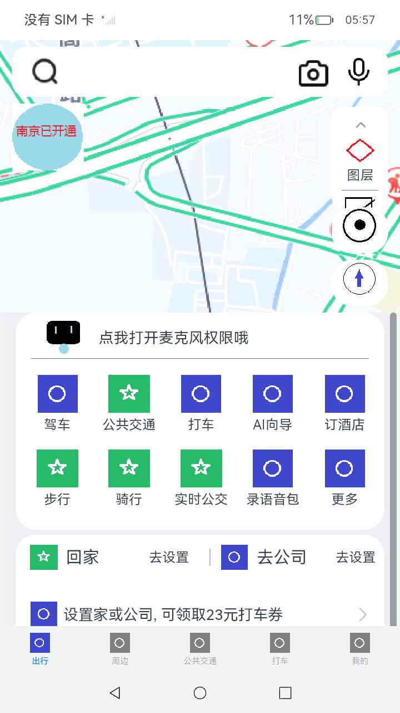

# MyMap

### 介绍

本示例主要模拟百度地图应用，使用ArkUI的组件实现应用的布局、动效等，复制应用的界面及交互，以此测试ArkUI是否足够支持地图应用的UX实现，以及是否存在问题;

### 效果预览

||


### 工程目录

```
entry/src/main/ets/
|---entryability
|---pages
|   |---Index.ets             
|   |---map
|   |   |---travel.ets      // 首页
|---util
|   |---Logger.ts
```


### 依赖

不涉及

### 相关权限
无

### 约束与限制

1. 本示例仅支持标准系统上运行，支持设备：RK3568；
2. 本示例仅支持API10版本SDK，版本号：4.0.10.13；
3. 本示例需要使用DevEco Studio 4.0 Release (Build Version: 4.0.0.600)；

### 下载

如需单独下载本工程，执行如下命令：

```
git init
git config core.sparsecheckout true
echo scenario/arkui/MyMap/ > .git/info/sparse-checkout
git remote add origin https://gitee.com/openharmony-sig/ostest_integration_test.git
git pull origin master
```